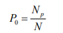

Este apartado ofrece lineamientos básicos para identificar, adaptar y desarrollar indicadores que permitan analizar riesgos a nivel local. Su propósito es facilitar el uso de datos disponibles en el territorio y apoyar la toma de decisiones informadas en contextos específicos.

# Vulnerabilidad Socioeconómica

<h3 style="color: red;">Índice de recuento o Tasa de pobreza</h3>
Mide la proporción de la población que se considera pobre, a menudo denotada como P₀.  

Donde:

- **Np** = número de personas pobres  
- **N** =  población total (o muestra)  

[Fuente: enalce](https://www.ilo.org/sites/default/files/wcmsp5/groups/public/%40americas/%40ro-lima/%40sro-port_of_spain/documents/presentation/wcms_304851.pdf)

<h3 style="color: red;">Tasa de Desempleo</h3>
Porcentaje de la población desocupada en relación a la población económicamente activa. 

**Tasa de Desempleo (TD):**

TD = (D / PEA) * 100

Donde:

- **TD** = Tasa de Desempleo  
- **D** = Número de Desempleados  
- **PEA** = Población Económicamente Activa

[Fuente: enalce](https://www.ine.gob.gt/ine/wp-content/uploads/2022/02/PublicacionResultadosENEI2021.pdf)

<h3 style="color: red;">Dependencia económica</h3>
Expresa el porcentaje de número de personas en edades dependientes (0 a 14 y 65 y más años de edad) por cada cien en edad económicamente productiva (15 a 64 años de edad)

DE= (Σ polbación entre 0 a 14 y 65 y más años / población de 15 a 64 años) * 100

[Fuente: enalce](https://www.undp.org/sites/g/files/zskgke326/files/2022-09/PADIT_Guía%20rápida%20sobre%20la%20dinámica%20de%20la%20población.pdf)

<h3 style="color: red;">Tasa de inactividad</h3>

Es el porcentaje de la población económicamente inactiva o no económicamente activa, con respecto a la población en edad de trabajar (10 años y más), durante un determinado periodo.

Tasa de inactividad = (PEI / PET) *100

Donde:

- **PEI** = Población económicamente inactiva  
- **PET** =  Población de edad de trabajar  

[Fuente: enalce](https://www.inec.gob.pa/redpan/sid/meta/META/Tasa_de_inactividad.htm#:~:text=Cálculo:%20Es%20el%20resultado%20de,económicamente%20activa%2C%20multiplicado%20por%20cien.)

<h3 style="color: red;"> Tasa de exclusión escolar</h3>
La exclusión escolar ha sido considerada como parte de las “expresiones educativas de la pobreza…
la exclusión educativa en cuanto acceso, permanencia y eficiencia, son las desigualdades en los
propios sistemas educativos” (Riveros, 1999)

[Fuente: enalce 1](https://uis.unesco.org/en/glossary-term/out-school-rate-1-year-primary-primary-education-lower-secondary-education-upper) /
[Fuente: enalce 2](https://databank.worldbank.org/metadataglossary/global-partnership-for-education/series/2.4_OOSC.RATE)

<h3 style="color: red;">Tasa de Incidencia</h3>

La tasa de incidencia es el número de personas que contraen una enfermedad durante un determinado período de tiempo por cada 1.000 habitantes expuestos al riesgo. La tasa de incidencia y otras tasas de morbilidad varían tan ampliamente que es posible utilizar cualquier constante para expresar la tasa de manera clara (desde "por 100" hasta "por 100.000").

TI = (Número de personas que contraen X enfermedad durante un período determinado / Población en riesgo) * K

Donde:

- **k** = constante para expresar la tasa 

[Fuente: enalce](https://www.inec.gob.pa/redpan/sid/glosario/WebHelp/glosario.htm#Tasa_de_incidencia_1.htm)

# Falta de Capacidad de Respuesta

<h3 style="color: red;">Acceso a Electricidad </h3>

La tasa de acceso a la electricidad para un determinado país o área, que representa la proporción de la población que se beneficia del acceso a la electricidad, se define como el número total de personas que viven en hogares con acceso a la electricidad dividido entre la población total.

AE = Población con acceso / Población total

[Fuente: enalce](https://iea.blob.core.windows.net/assets/cc0ed3f6-84e5-465c-920c-62f2be286db1/GuidebookforImprovedElectricityAccessStatistics.pdf)

<h3 style="color: red;">Acceso al Agua </h3>

La tasa de acceso al agua para un determinado país o área, que representa la proporción de la población que se beneficia del acceso a un sistema agua, se define como el número total de personas que viven en hogares con acceso dividido entre la población total.

AE = Población con acceso / Población total

# Indices intermedios

Medir el nivel relativo de riesgo a nivel local, considerando la incidencia de por ejemplo enfermedades transmitidas por vectores (arbovirosis) como Dengue Clásico, Dengue Hemorrágico y Chikungunya. Este índice puede formar parte de la dimensión de “Vulnerabilidad” o “Condiciones de salud” dentro del enfoque del INFORM Risk Index adaptado a nivel local.

Pasos a seguir. 

**Seleccionar datos a utilizar**

Para cada aldea o unidad geográfica, se consideran:

|Código	|Indicador	|Descripción|
|--------|----------|------------|
|A	|% de personas con Dengue Clásico	|Casos / Población total × 100|
|B	|% de personas con Dengue Hemorrágico	|Casos / Población total × 100|
|C	|% de personas con Chikungunya	|Casos / Población total × 100|

**Ponderación de Indicadores**

Se asignan pesos a cada indicador según su gravedad epidemiológica:

|Indicador|	Peso|
|----|---|
|Dengue Clásico (A)|	0.3|
|Dengue Hemorrágico (B)|	0.4|
|Chikungunya (C)|	0.3|

Nota: Puedes ajustar los pesos según el contexto nacional/local o con expertos en la materia

**Cálculo del índice intermedio** 

Se calcula como una combinación ponderada de los valores normalizados:
 
 Indice Intermedio=(A​ ×0.3)+(B ×0.4)+(C ×0.3)

[Fuente: enalce 1](https://knowledge4policy.ec.europa.eu/publication/handbook-constructing-composite-indicators-methodology-user-guide-0_en) 
